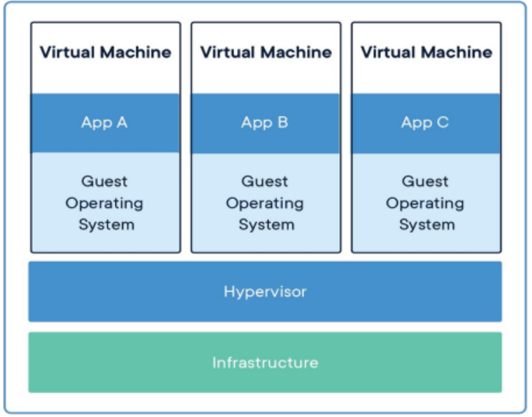
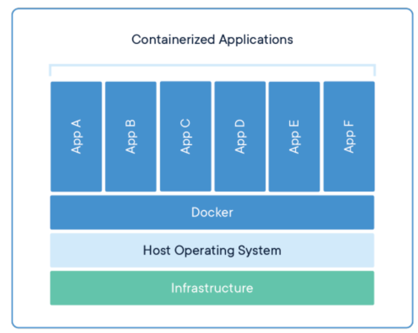

# 🐳 Introducción a Docker

## ¿Qué es Docker?

**Docker** es un proyecto de código abierto que permite empaquetar, distribuir y ejecutar aplicaciones dentro de **contenedores**.  
Estos contenedores aíslan la aplicación y todas sus dependencias, garantizando que se ejecuten de manera **consistente** en cualquier entorno, desde una laptop hasta servidores de producción.

Docker aporta una **capa de abstracción** sobre el sistema operativo, automatizando la creación, despliegue y gestión de aplicaciones de forma **liviana**, **rápida** y **eficiente**.

### 🔥 ¿Por qué Docker es importante?
- Resuelve el clásico problema de "**en mi máquina funciona**", asegurando entornos replicables.
- Permite un desarrollo y despliegue **más rápido**.
- Facilita la adopción de **arquitecturas de microservicios**.
- Optimiza el uso de **recursos** del sistema frente a máquinas virtuales tradicionales.

---

## Contenedores vs Máquinas Virtuales

### 🛠 Diferencias principales:

| Característica | Contenedores | Máquinas Virtuales |
|:---------------|:-------------|:------------------|
| Virtualización | A nivel de sistema operativo (comparten el kernel) | A nivel de hardware (requieren hipervisor) |
| Peso | Livianos (MBs) | Pesados (GBs) |
| Velocidad de arranque | Segundos | Minutos |
| Consumo de recursos | Bajo | Alto |
| Portabilidad | Muy alta | Media |
| Casos de uso ideales | Microservicios, despliegue rápido, CI/CD | Entornos de aislamiento total, aplicaciones monolíticas |

---

### 📷 Arquitectura tradicional basada en máquinas virtuales

- Cada aplicación necesita su propio **sistema operativo invitado** (Guest OS).
- El **hipervisor** gestiona los recursos y la virtualización del hardware.
- Mayor uso de CPU, RAM y almacenamiento.

---

### 📷 Arquitectura moderna basada en contenedores

- Todas las aplicaciones comparten el **mismo sistema operativo base**.
- Los contenedores son aislados, pero mucho más ligeros que una VM.
- Docker gestiona los contenedores encima del Host OS.

---

## ¿Qué es un contenedor Docker?

Un **contenedor Docker** es una **unidad estandarizada de software** que incluye:
- El código de la aplicación.
- Librerías y paquetes necesarios.
- Herramientas del sistema.
- Configuraciones específicas.

Todo esto empaquetado en un solo archivo portable que se puede ejecutar en cualquier sistema que tenga Docker instalado.

### 📦 Conceptos importantes:

- **Imagen Docker**: Plantilla inmutable que define cómo se crea un contenedor.
- **Contenedor Docker**: Instancia en ejecución de una imagen.

> Una **imagen** es como una receta de cocina; un **contenedor** es el plato servido.

---

## 🚀 Ventajas de usar Docker

- **Portabilidad** entre ambientes de desarrollo, test y producción.
- **Escalabilidad** rápida.
- **Aislamiento** de procesos y servicios.
- **Velocidad** de despliegue.
- **Consistencia** de ambientes.
- **Eficiencia** en uso de recursos.

---

# ✅ Resumen

- Docker facilita la creación, empaquetado y despliegue de aplicaciones modernas.
- Los contenedores son ligeros, portables y reproducibles.
- Docker ha revolucionado la forma de desarrollar software, especialmente en entornos de microservicios y DevOps.

